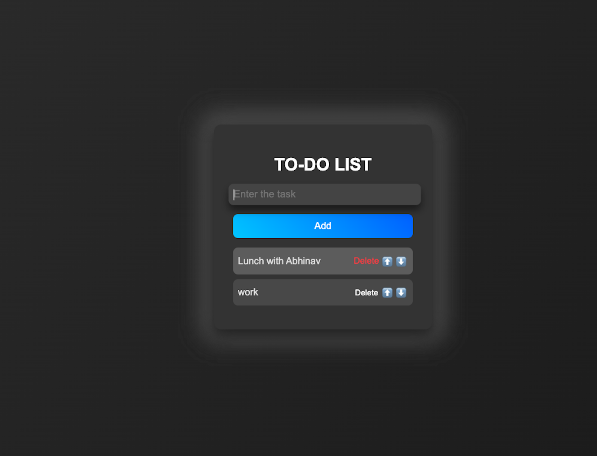

# To-Do List App

A simple and interactive To-Do List application built with React and styled using modern CSS techniques. The app allows users to add, remove, and rearrange tasks, offering a clean and responsive user interface.

## Features

- **Add Tasks:** Users can easily add tasks to their to-do list by typing in the input field and pressing the "Add" button or the Enter key.
- **Remove Tasks:** Users can remove tasks from the list by clicking the "Delete" button next to each task.
- **Reorder Tasks:** Users can move tasks up or down within the list using the provided arrow buttons.
- **Responsive Design:** The app is designed to be responsive and works well on both desktop and mobile devices.
- **Modern Styling:** Utilizes modern CSS features such as gradients, animations, and keyframes for a visually appealing user interface.
- https://singhabhinav04.github.io/to-do-list/

